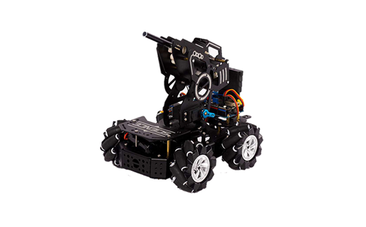

OpenBlock 在设计之时就考虑到了第三方厂商或工作室对软件定制化的需求，可在不涉及到源代码编译的情况下对设备选项及扩展进行随意的增减与调整顺序。

!!! warning
    此栏目中讲述的定制方法定义添加的设备必须是由软件内置的 [基础控制板 deviceId](./reference.md#deviceid) 衍生，如由 ArduinoUno 衍生的各类自带驱动等外设和定制接口的第三方控制板。如希望添加新构架的设备请参考 [软件开发者资料](../../develop-from-source/add-a-new-board) 或在社区请愿。

## 离线版 OpenBlock 定制化步骤

1. [下载并安装OpenBlock社区版](#openblock_1)
2. [修改插件与设备内容](#_1)
3. [修改软件后缀名并二次打包](#_5)

### 下载并安装 OpenBlock 桌面版

下载并安装 OpenBlock 桌面版，安装完成后需要开启一次软件，用以生成缓存目录。

### 修改插件与设备内容

#### 文件结构

在完成软件安装后，我们进入安装目录，打开 `OpenBlock/resources/external-resources` 文件夹，可见如下文件内容。其中 **devices** 目录中存放设备配置，**extensions** 目录中存放设备扩展。我们在定制过程中仅需要对这两个文件夹中的内容进行修改即可。


#### 添加设备/套件

进入 device 目录我们会看到有2个 **.js** 格式的文件和多个文件夹。


其中文件夹以厂商名称命名，内部放置了该厂商产品设备的描述。**config.js** 则控制设备选择界面中加载的设备内容和显示顺序。**locales.js** 多语言支持的翻译文件。整个文件结构如下形式：

```
devices
	|- 厂商1/
		|- 产品1/
		|- 产品2/
		|- 产品3/
	|- 厂商2/
		|- 产品1/
		|- 产品2/
	|- XXX/
	|- device.js
	|- locales.js
```

首先我们介绍产品配置目录，下面以 **YQCRobot/ironKit** 为例。这里路径下的文件内容如下：

```
YQCRobot/ironKit
	|- asset/
		|- ironKit.png
		|- ironKit-illustration.svg
		|- ironKit-small.svg
	|- index.js
```

---

**Index.js**

其中index.js为最关键的设备描述文件，asset中存放的设备也将由该文件导入。我们来看他的内容：

```js
const ironKit = formatMessage => ({
    name: 'IronKit',
    deviceId: 'ironKit_arduinoUno',
    manufactor: 'YQC Robot',
    leanMore: 'https://item.taobao.com/item.htm?id=628120335101',
    iconURL: 'asset/ironKit.png',
    description: formatMessage({
        id: 'ironKit.description',
        default: 'Yiqichuang iron kit robot.',
        description: 'Description for the YQC iron kit device'
    }),
    disabled: false,
    bluetoothRequired: false,
    serialportRequired: true,
    defaultBaudRate: '9600',
    pnpidList: null, // Use default pnp list
    internetConnectionRequired: false,
    launchPeripheralConnectionFlow: true,
    useAutoScan: false,
    connectionIconURL: 'asset/ironKit-illustration.svg',
    connectionSmallIconURL: 'asset/ironKit-small.svg',
    programMode: ['realtime', 'upload'],
    programLanguage: ['block', 'cpp'],
    tags: ['kit'],
    deviceExtensions: ['ironKit'],
    deviceExtensionsCompatible: 'arduinoUno',
    helpLink: 'https://www.sxyiqichuang.com/'
});

module.exports = ironKit;
```

- 参数说明：

    - name

        设备名称，显示在设备选择界面中的设备名称。

    - deviceId

        设备id，此id极为重要，其直接控制了选择该设备后一些列的后台功能处理作，必须按照规定形式组成：{定制设备名称 id}_(基础控制板 id)。其中定制设备的名称 id 需按照驼峰规则以没有空格的英文名称为标准。下划线后的基础控制板 id 则需要使用软件内置的基础控制板的 deviceId。可用选项可查看 [基础控制板 deviceId](./reference.md#deviceid) 获取。

    - manufactor

        制造商，显示在设备选择界面中。

    - leanMore

        放置制造商链接，将在点击设备名称或了解更多的按钮时打开，建议设定为公司网站或商城地址。

    - iconURL

        设备图片，显示在设备选择界面中。应设置为asset中图片的相对路径。

    - description

        设备描述，在设备选择界面的设备图片下方显示，这里使用了FormattedMessage来提供多种语言下的不同翻译内容。

    - disabled

        如果设置为true，将会禁用这个设备选项，将显示为灰色无法被选取，并标上即将推出的标签。

    - bluetoothRequired/serialportRequired/internetConnectionRequired

        设置为true将在设备选择界面要求栏中显示对应连接的图标，这几个参数只用于显示图标不会影响实际的连接功能。

    - defaultBaudRate

        用于设定设备默认使用的串口终端波特率。

    - pnpidList

        此参数用于控制，串口扫描程序的过滤器。只有符合这个列表中的 VID/PID 号的串口设备才会在设备连接窗口中显示，通过设定此参数可有效屏蔽台式机自带的串口或其他不相关设备的串口，放置客户由于选择串口而带来的问题。可用的选项如下：

        | 值               | 功能                                 |
        | ---------------- | ----------------------------------- |
        | null             | 启用该设备衍生母板的默认配置            |
        | '*'              | 关闭过滤器，显示全部可选择的串口         |
        | 具体的硬件ID数组 | 设定过滤器仅显示该设定设置的硬件设备       |

        常用的具体的硬件ID请参考：[常见硬件ID](./reference.md#id_1)

    - launchPeripheralConnectionFlow

        设置为true会在选择设备后自动开启设备连接界面，建议设置为true。

    - useAutoScan

        设置为true，将会自动连接扫描出的设备，不建议开启。

    - connectionIconURL

        在设备连接成功的界面中显示。

    - connectionSmallIconURL

        在设备连接界面的标题栏中显示。

    - programMode

        设定设备支持的编程模式。在设备不支持对应的编程模式时，会自动切换到支持的模式并锁定模式切换开关。同时也控制在设备选择界面中编程模式栏中的显示。

    - programLanguage

        仅用于在设备选择界面中编程语言栏中控制图标显示。

    - deviceExtensions

        为该数组赋值可以在选择控制板后，自动加载设定的扩展插件。如在赋值为 `dht11` 时，在选择该控制板后 dht11 插件将被自动加载。一般在第三方套件中常设定为对应套件的扩展插件。即专门编写一个带有全部套件积木的扩展插件来专供此设备加载使用。

    - deviceExtensionsCompatible

        设备扩展插件兼容性。通过设定该值可使得此设备使用为其他控制板编写的插件。如此处设定了 `arduinoUno` ，即设备扩展插件界面将同时加载支持 arduino uno 的插件。

    - helpLink

        设备连接界面与选择界面中点击帮助按钮就会打开这个链接，建议设定至产品Wiki地址。

!!! note
    formatMessage 也可以用在 name 中，用于设定在不同语言下显示不同的名称。不过需要注意的是 id 作为 formatMessage 的唯一识别符，请勿在不同值的内容中设定相同的 id ，否则内容将会被重复和混淆。

---

**asset**

这个文件夹中存放着在 index.js 中导入的设备图片。设备图片的分辨率和风格推荐按照以下参数设计。

1. 根据以下参数与示例图片制作设备的图片，请确保在周围留有合适宽度的白色边缘，以保证风格统一， 这个图片将用于显示在设备选择界面中。

    **格式**：png

    **分辨率**：600x372

    **背景色**：白色

    你可以直接保存下面这个图片来修改制作，在完成后以驼峰规则命名这个图片文件，如：`ironKit.png`

    

2. 制作生成 svg 格式的图片。在这一步中制作的两个图片将用于在连接设备时的界面上。

    将控制板主体扣出，删除图片的背景，并将图片长宽比调整为108：87，将控制板置于正中并，使得图片边缘尽可能的贴近控制板。而后保存为 png 格式。随后再将图片以同样的要求调整长宽比为 1：1，再次保存。

    访问这个在线格式转换的网站：[aconvert.com](https://www.aconvert.com/image/)。将刚刚制作好的两张图片上传转换为 SVG 格式，记住要选择 **Resize image** 选项，将其分别设置为 **108x87** 和 **40x40**。

    将 108x87 的图片名称为：`<device name>-illustration.svg`，如：`ironKit-illustration.svg`

    

    将 1:1 的图片名称为：`<device name>-small.svg`，如 : `ironKit-small.svg`

    

---

**locales.js**

这个文件用于翻译在 index.js 中使用的 formatMessage。显而易见，我们通过在此文件中加入使用的 id ，并对其赋值即可完成对该 id 对应字段的翻译。

```js
module.exports = {
    'en': {
        'ironKit.description': 'Yiqichuang iron kit robot.',
        'QDPRobot.description': 'QDP robot.'
    },
    'zh-cn': {
        'ironKit.description': '意启创金属套件机器人。',
        'QDPRobot.description': '齐护机器人。'
    }
};
```

---

**config.js**

此文件用于控制设备选择列表中的显示内容和显示顺序。Openblock默认设定了系统内置控制板 + 三个第三方控制板的，此处使用的就是设备的 deviceId ，数据的顺序即对应设备在选择界面中的顺序。在添加新的设备后，对此表进行修改调整即可。

```js
module.exports = [
    // Buid-in device
    'arduinoUno',
    'arduinoNano',
    'arduinoMini',
    'arduinoLeonardo',
    'arduinoMega2560',
    'arduinoEsp32',
    'microbit',
    'microbitV2',
    'maixduino',
    // Third party
    'ironKit_arduinoUno',
    'QDPRobot_arduinoUnoUltra',
    'QDPRobotC02_arduinoEsp32'
];
```

---

将你想要添加的设备按照如上述所示，置于文件结构内并修改 locales.js 和 device.js 文件即可完成对设备的添加。

!!! warning
    在这个过程中修改配置的文件为简单的脚本代码，请务必遵照已有文件的格式规范，并使用半角标点，否则程序解析配置会失败造成错误。

#### 添加插件

我们在设计一个设备（套件 ）时，如果不配备其对应的插件内容，就只会加载其母控制板所拥有的默认积木，所以一般来说都会为其配备专属的插件内容，并将其 id 设置进入对应设备的 deviceExtensions 属性中，使得设备在选择后自动加载这些插件，来实现该设备的特定应用功能。

在 resources/extensions 目录下添加设备对应插件，此步骤与插件介绍内容基本一致。唯一不同的是，为了阻止该插件显示在设备插件的选择目录中（防止用户点错而卸载套件对应插件），其插件 index.js 中，`supportDevice` 需设定为空值。如下所示：

```js
const ironKit = formatMessage => ({
    name: 'Iron Kit',
    extensionId: 'ironKit',
    version: '1.0.0',
    type: 'arduino',
    supportDevice: [], // Hide kit extension in library
    author: 'ArthurZheng',
    iconURL: `asset/ironKit.png`,
    description: formatMessage({
        id: 'ironKit.description',
        default: 'Yiqichuang iron kit robot.',
        description: 'Description of ironKit'
    }),
    featured: true,
    blocks: `blocks.js`,
    generator: `generator.js`,
    toolbox: `toolbox.js`,
    msg: `msg.js`,
    tags: ['kit'],
    helpLink: 'https://www.sxyiqichuang.com'
});

module.exports = ironKit;
```

#### 修改插件更新的服务器地址

Openblock 外部插件及设备自动更新功能是通过查找下载 github 及 gitee 的仓库的 Release 实现，仓库地址在 `OpenBlock/resources/external-resources/config.json` 中定义。具体使用 github 还是 gitee 地址则根据用户系统语言决定，防止中国区客户由于对 github 访问较慢导致更新时间过长的问题。

```json
{
    "repository":"openblockcc/external-resources",
    "version":"v1.0.1"
}
```

- 关闭自动更新功能

    将 repository 设置为空值即可实现。

    ```json
    "repository":"",
    ```

- 搭建你自己的更新服务器

    1. 首先需要在 github 以及 gitee 上注册两个 user 相同的账户或组织。如 Openblock 的 `https://github.com/openblockcc` 与 `https://gitee.com/openblockcc`。
    2. 在 github 上 fork 社区的外部资源仓库：[https://github.com/openblockcc/external-resources](https://github.com/openblockcc/external-resources)
    3. 克隆你 fork 下来的仓库，添加你想要的套件和插件内容。
    4. 克隆下来的文件中的 config.json 中的 repository 为你的 user 和仓库地址。

        ```json
        {
            "repository": "user/repo"
        }
        ```

    5. push 修改后的代码到你的仓库。
    6. 在 github 上发布一个 releases， 注 Tag version 与 Release title 均为新的版本号，并在 Describe 中填入此次更新的内容，建议按照下方格式描述（此处建议使用英文）。

        ```md
        1. 内容1
        2. 内容2
        ```

        而后点击 Publish release 发布。

    7. 在 gitee 上导入 fork 后对应的 github 仓库（之后 github 每次修改后都在 gitee 的仓库名称后中点击同步按钮同步即可），以同样方式发布 Release，不过此处 Describe 中使用中文说明。
    8. 修改软件目录下 `OpenBlock/resources/external-resources/config.json` 中的地址与上述修改的地址一致。
    9. 这样远程更新服务器的搭建以及更新地址得到修改就完成了。

### 修改软件后缀名并二次打包

#### 修改软件后缀名

为了区分各方二次打包后的软件版本，Openblock 特意设定此规范用以方便终端用户与服务人员识别软件发布方。

1. 修改安装目录下的 exe 文件名

    名称以 `OpenBlock + '-' + 厂商名.exe` 组成，如 `OpenBlock-YQC.exe`

2. 修改顶层文件夹名称

    名称以 `OpenBlock + '-' + 厂商名` 组成，如 `OpenBlock-YQC`

#### 二次打包

使用 7z 等压缩工具或其他类型的打包软件将修改完成后的软件目录打包即可。
